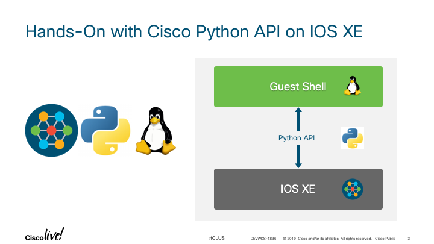

# DEVWKS-1836 (Cisco Live US 2019)

This is the repository for Cisco Live US 2019 DEVWKS-1836 - Hands-On with Cisco Python API on IOS XE

* [Abstract](ABSTRACT.md)
* [Agenda](AGENDA.md)
* [Speaker's Bio](BIO.md)
* [Live Workshop Guide](guide/DEVWKS-1836-Live.md) -or- [Self-Paced Workshop Guide](guide/DEVWKS-1836-00-Intro.md)

## Motivation

Although many Cisco Live sessions discuss Cisco Python API on IOS XE, most only in passing.  This workshop is focussed 
solely on the Cisco Python API for on-box network programmability specifically, demonstrating how each of the the Cisco 
Python API library functions work. 

## Show Me!

## Authors & Maintainers

Smart people responsible for the creation and maintenance of this project:

- Curtis Smith <curtissm@cisco.com>

## Credits

The source material for this workshop came from the:

* [Programmability Configuration Guide, Cisco IOS XE Fuji 16.8.x](https://www.cisco.com/c/en/us/td/docs/ios-xml/ios/prog/configuration/168/b_168_programmability_cg.html)
* [Cisco IOS XE Programmability eBook](Cisco IOS XE Programmability e-book
https://www.cisco.com/c/dam/en/us/products/.../nb-06-ios-xe-prog-ebook-cte-en.pdf)

## License

This project is licensed to you under the terms of the [Cisco Sample Code License](./LICENSE).
